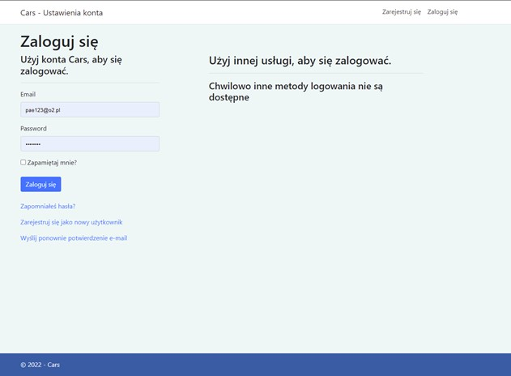
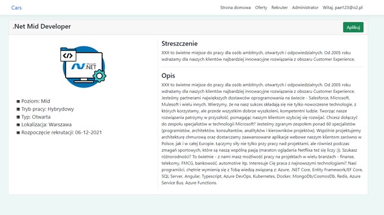
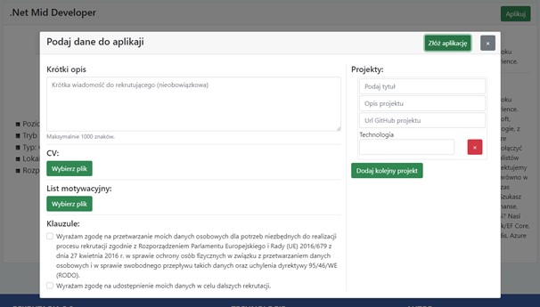
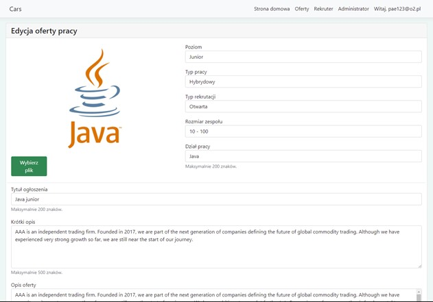
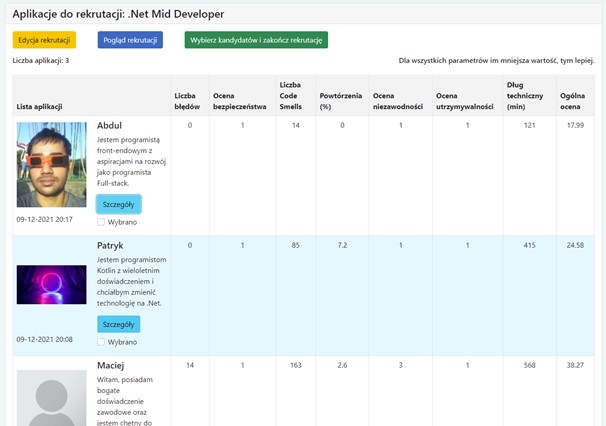

# Projekt do pracy inżynierskiej - Cars (Code Analysis Recruitment System)

[Pogląd strony opublikowanej na platformie Azure](https://cars-pamsolik.azurewebsites.net/)

## Politechnika Łódzka Wydział Fizyki Technicznej Informatyki i Matematyki Stosowanej

## Wprowadzenie
Proponowanym rozwiązaniem jest aplikacja sieciowa pozwalająca na przeprowadzenie kompletnego procesu rekrutacji. Posiada ona autoryzację użytkowników oraz kontrolę ich uprawnień. Dodatkowo umożliwia wstępną ocenę kandydatów na podstawie analizy kodu źródłowego złożonego przez nich przy aplikowaniu do oferty pracy, kod źródłowy, zgłoszony przez kandydatów jest analizowany automatycznie po złożeniu aplikacji do oferty pracy. Rekruterzy mają możliwość poglądu na listę kandydatów oraz sortowanie ich po wybranym kryterium. Administratorzy mogą zarządzać uprawnieniami użytkowników oraz przeglądać oraz edytować wszystkie rekrutacje.

Statyczna analiza kodu źródłowego jest możliwa za pośrednictwem usługi SonarQube. 
SonarQube to narzędzie do automatycznego sprawdzania jakości kodu, które wykrywa błędy, luki w zabezpieczeniach i „zapachy kodu”. Posiada integracje z systemami kontroli wersji, aby umożliwić ciągłą kontrolę kodu źródłowego. 

## Autor

Patryk Amsolik

## Promotor

dr inż. Łukasz Chomątek

## Informacje

|              |              |
| ------------ | ------------ |
| Semestr: | VII |
| Specjalizacja: | IOAD |
| Termin: | TODO |
| Języki: | C#, TS, JS |

## Technologie

* [ASP.NET 6](https://dotnet.microsoft.com/en-us/apps/aspnet)
* [Angular 12](https://angular.io/)
* [PostgreSQL](https://www.postgresql.org/)
* [Entity Framework 6](https://docs.microsoft.com/en-us/ef/ef6/)
* [Identity Server](https://duendesoftware.com/)
* [SonarQube](https://www.sonarqube.org/)
* [Azure](https://azure.microsoft.com/en-us/)

## Galeria

